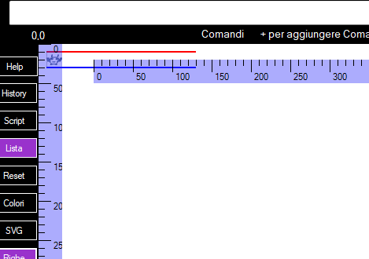
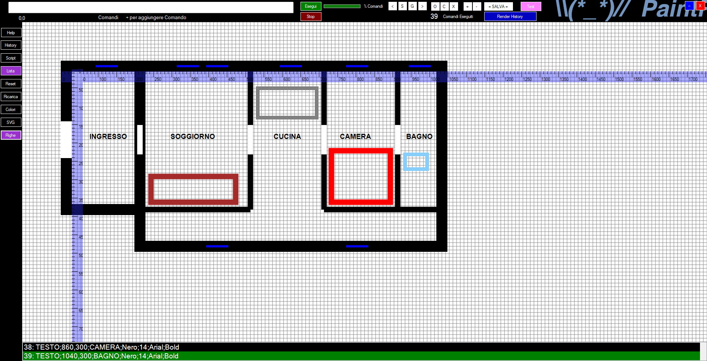

# PaintRobot 🖌️🤖


**PaintRobot** è una applicazione **WinForms VB.NET (.NET Framework 4.8.1)** che esegue comandi grafici tramite script, ispirandosi allo stile di AutoCAD ma con un approccio completamente automatico.

Non è un CAD interattivo: PaintRobot disegna **solo** ciò che viene descritto in uno script, garantendo risultati sempre identici e riproducibili.




---

## 📌 Caratteristiche principali

- Rendering grafico **timer-driven**
- Esecuzione rapida di **migliaia di comandi grafici**
- Esecuzione di comandi STEP/CONTINUE
- Esecuzione di comandi da History Commands
- Linguaggio proprietario **PaintRobotScript**
- Nessuna interferenza dell’utente durante il disegno
- Output coerente su qualsiasi sistema Windows
- ZOOM e PAN con mouse e pulsanti
- Guida in App e CHM accessibile con F1
- Autocompletamento del COMANDO mentre scrivi
- Macro definibili con DEFINE/END
- Cicli FOR/END non annidabili
- Concetti di Punto Iniziale e Ultimo Punto (FROM / LAST)
- Comando VAI per spostarti nello script
- Righelli Orizzontale e Verticale trasparenti, spostabili, Pixel-metered
- Esportazione in SVG
- Ideale per disegno automatico, generativo o standardizzato
- Modalità Test: salva un file test.txt con migliaia di comandi casuali

---

## 🎤 CAD Vocale (Novità)

Il CAD supporta l’input vocale in tempo reale tramite **Accesso Vocale di Windows**.

È possibile **disegnare parlando**, senza tastiera o mouse:
- I comandi vengono interpretati mentre vengono dettati
- Le coordinate vocali vengono normalizzate automaticamente
- Gli errori tipici del riconoscimento vocale (spazi, virgole mancanti, separatori) vengono corretti a runtime

---

## ❓ Cos’è PaintRobot

PaintRobot **non è AutoCAD**.  
È un motore grafico che interpreta uno script e disegna automaticamente forme, pattern, testi e immagini.

Attualmente **non è possibile modificare il disegno con mouse o tastiera**: tutto passa dallo script.

---

## ⚙️ Come funziona

PaintRobot utilizza una tecnologia chiamata **Timer-Driven Rendering**:

- I comandi vengono eseguiti a blocchi
- Un singolo ciclo di rendering
- L’esecuzione può solo essere avviata o fermata
- Massima velocità e coerenza del risultato

---

## 📋 Esempi dei Comandi

Alcuni Esempi dei comandi grafici presenti in questa versione:

```text
#Un comando alla volta
STEP;1
INIZIO
LINEA;7,10;96,92;Blu;2
RETT;50,50;200,150;Nero;VUOTO;2
CERCHIO;200,200;50;Rosso;PIENO;3
TRIANG;72,50;440,358;17,340;Rosso;VUOTO;1
ADDLIVELLO;Uno
PULISCI;Bianco
ARCO;50,50;150,150;Rosso;PIENO;2;0;180
ARCO;200,50;300,150;Blu;VUOTO;3;90;270
SCACCHI;100,10;400,310;Blu;Rosso
TESTO;100,200;Ciao mondo;Rosso;20;Arial;Normal
POLIGONO;10,10;100,30;80,120;30,90;Verde;PIENO
GRIGLIA;20;Grigio
SALVA;C:\Temp\foto.jpg;JPG
INVERTI;Verticale;-50
RUOTA;-45
ADDLIVELLO;Due
APPUNTI
COPIA;C:\Immagini\foto.png
INCOLLA;50,100
RIDIMENSIONA;Appunti;400,400
SPLINE;29,15;53,500;1000,183;Giallo;1
SPLINE2;10,10;50,80;100,50;150,120;Blu;2;0.7
SPIRALE;400,300;10;150;5;Blu;2;Oraria
SINUSOIDE;600,200;700,200;50;25;Blu;2
CROCE;50,50;100,100;Arancio;3
BEZIER;800,320;850,340;900,310;950,210;VIOLA;2
TEXTURE;Texture01;C:\TEXTURE\textures_autocad_45635.gif
DRAWTEXTURE;Texture01;950,400
PATTERN;PUNTI;DOT;1000;10;Nero;1
FILLPATTERN;PUNTI;1000,100;400,300
MATRICE;100,200;300,200;250,350;150,350;20,20;punti;Malva;2
MATRICE;500,200;700,200;650,350;550,350;20,20;punti;Rosso;2
MATRICEQ;800,400;1000,700;10,10;Quadrati;Verde;2
#INIZIOMATH;20;10;Blu
#INIZIOCAD;10;Lime
#
#MACRO
#Test Include altro script che crea una marco FRECCIA1
INCLUDE;C:\Users\user\Desktop\ScriptINCLUDE.txt
#
#Disegna le freccie con FRECCIA1
FRECCIA1;1000;200;80
FRECCIA1;1000;250;120
#
#TEST - Cicli For
FOR;X;200;300;25
LINEA;{X},100;{X},200;Blu;1
END
#
#TEST - For+Macro
FOR;Y;100;300;50
FRECCIA1;100;{Y};80
END
#
#TEST - Step Negativo
FOR;X;500;200;-20
LINEA;{X},10;{X},100;Rosso;1
END

#ScriptINCLUDE.txt
DEFINE;FRECCIA1;X;Y;L
# Crea una freccia
LINEA;{X},{Y};{X+L},{Y};Nero;3
LINEA;{X+L},{Y};{X+L-10},{Y-5};Rosso;2
LINEA;{X+L},{Y};{X+L-10},{Y+5};Verde;2
END

#Poligono manuale
MUOVI;100,100
Linea;FROM;200,100;Blu;2
Linea;LAST;200,200;Blu;2
Linea;LAST;100,200;Rosso;2
CHIUDI;100,100;Rosso;2
```

## 👤 A chi è utile

PaintRobot è utile se ti serve:

- Un **CAD automatico**
- Disegni sempre identici e standardizzati
- Nessuna variabilità dovuta all’operatore
- Generazione grafica tramite script

---

## 🛠️ Modifica del codice

Il progetto è **open source**.  
Puoi modificare liberamente il codice sorgente secondo i termini della licenza.

---

## 📜 Licenza

**MIT License / Public**  
Usalo, modificalo e ridistribuiscilo liberamente.

---


## 📜 Sintassi Comandi Linguaggio PaintRobotScript

Ecco la sintassi di tutti i comandi disponibili:

```text
LINEA       ; LINEA;x1,y1;x2,y2;Colore;Spessore
CERCHIO     ; CERCHIO;x,y;Raggio;Colore;Spessore
RETT        ; RETT;x1,y1;x2,y2;Tipo;Colore;Spessore
TRIANG      ; TRIANG;x1,y1;x2,y2;x3,y3;Colore;Tipo;Spessore
PULISCI     ; PULISCI;Colore
ARCO        ; ARCO;x1,y1;x2,y2;Colore;Tipo;Spessore;AngoloStart;AngoloSweep
SCACCHI     ; SCACCHI;x1,y1;x2,y2;Colore;Colore2
TESTO       ; TESTO;x1,y1;x2,y2;Testo;Colore;Dimensione;Font;Stile
POLIGONO    ; POLIGONO;xN,yN;Colore;Tipo
GRIGLIA     ; GRIGLIA;Lato;Colore
SALVA       ; SALVA;Percorso;Formato(PNG,BMP,JPG)
INVERTI     ; INVERTI;Direzione;-Percentuale
RUOTA       ; RUOTA;Gradi;-Percentuale
APPUNTI     ; APPUNTI
COPIA       ; COPIA;Percorso
INCOLLA     ; INCOLLA;x1,y1
RIDIMENSIONA; RIDIMENSIONA;Appunti;Larghezza,Altezza
SPLINE      ; SPLINE;xN,yN;Colore;Spessore
SPLINE2     ; SPLINE2;xN,yN;Colore;Spessore;Tensione
#           ; #Commento
CROCE       ; CROCE;x1,y1;x2,y2;Colore;Spessore
BEZIER      ; BEZIER;x1,y1;x2,y2;x3,y3;x4,y4;Colore;Spessore
TEXTURE     ; TEXTURE;Nome;Percorso
DRAWTEXTURE ; DRAWTEXTURE;Nome;x,y
PATTERN     ; PATTERN;Nome;LINEE;Angolo;Spaziatura;Colore;Spessore
FILLPATTERN ; FILLPATTERN;Nome;x1,y1;x2,y2
INIZIO      ; INIZIO
INIZIOCAD   ; INIZIOCAD;Passo;Colore
INIZIOMATH  ; INIZIOMATH;ScalaX;ScalaY;ColoreScale
ADDLIVELLO  ; ADDLIVELLO;NomeLivello
DELLIVELLO  ; DELLIVELLO;NomeLivello
RENLIVELLO  ; RENLIVELLO;NomeLivello;NuovoNomeLivello
STEP        ; STEP;Numero
GRIGLIAFULL ; GRIGLIAFULL;Lato;Colore
FRECCIA     ; FRECCIA;x1,y1;x2,y2;Colore;Spessore
STELLA      ; STELLA;x,y;NumeroPunte;Diametro;Colore;Spessore
DEFINE      ; DEFINE;NomeMacro;Parametri;L
END         ; END
FOR         ; FOR;NomeCiclo;Start;End;Step
INCLUDE     ; INCLUDE;PercorsoFile
MATRICE     ; MATRICE;x1,y1;x2,y2,xN,yN;PassoX,PassoY;Tipo;Spessore
MATRICEQ    ; MATRICEQ;x1,y1;x2,y2;PASSOX,PASSOY;Tipo;Colore;Spessore
MUOVI       ; MUOVI;x,y
CHIUDI      ; CHIUDI;x,y;Colore;Spessore
VAI         ; VAI;NumeroComando
SPIRALE     ; SPIRALE;CentroX,CentroY;RaggioIniziale;RaggioFinale;Giri;Colore;Spessore;Direzione
SINUSOIDE   ; SINUSOIDE;StartX,StartY;EndX,EndY;Ampiezza;Frequenza;Colore;Spessore

   Il comando END non ha parametri è il terminatore per DEFINE e FOR.
   Il comando FOR non supporta Step=0 (Zero).
```

## 🎨 Colori Italiani Supportati

Il dizionario ColoriItaliani permette di usare nomi in italiano per i colori. L’elenco completo:

```text

[Colori base]
NERO → Black
BIANCO → White
ROSSO → Red
VERDE → Green
BLU → Blue
GIALLO → Yellow
CIANO → Cyan
MAGENTA → Magenta
GRIGIO → Gray
ARGENTO → Silver

[Colori caldi e naturali]
MARRONE → Brown
MARRONECHIARO → Peru
MARRONESCURO → Sienna
ARANCIONE → Orange
ROSSOSCURO → DarkRed
ROSSOCHIARO → IndianRed
SALMONE → Salmon
CORALLO → Coral
TERRA → SaddleBrown
SABBIA → SandyBrown
SENAPE → Goldenrod
OCRA → RGB(204, 119, 34)
RUGGINE → RGB(183, 65, 14)
RAME → RGB(184, 115, 51)
BRONZO → RGB(205, 127, 50)
MOGANO → RGB(192, 64, 0)
CASTAGNO → RGB(205, 92, 92)
CARBONE → RGB(5, 4, 2)

[Colori freddi]
AZZURRO → LightBlue
BLUSCURO → DarkBlue
BLUCHIARO → LightSkyBlue
CIELO → SkyBlue
ACQUA → Aqua
ACQUAMARINA → RGB(0, 255, 128)
TURCHESE → Teal
CERULEO → RGB(0, 123, 167)
COBALTO → RGB(0, 71, 171)
INDACO → Indigo
GHIACCIO → LightCyan
ARDESIA → RGB(119, 136, 153)

[Verdi e derivati]
VERDECHIARO → LightGreen
VERDESCURO → DarkGreen
LIME → Lime
OLIVA → Olive
GIADA → RGB(0, 168, 107)
CHARTREUSE → RGB(128, 255, 0)

[Viola, rosa e affini]
VIOLA → Purple
VIOLACHIARO → Lavender
VIOLASCURO → MediumPurple
MELANZANA → DarkViolet
BORDEAUX → DarkRed
BORGOGNA → RGB(128, 0, 32)
PRUGNA → Plum
FUXIA → Fuchsia
ROSA → Pink
MALVA → RGB(224, 176, 255)
LILLA → RGB(200, 162, 200)
CILIEGIA → RGB(222, 49, 99)
CARMINIO → RGB(150, 0, 24)
GRANATA → RGB(128, 0, 0)

[Toni chiari e neutri]
BEIGE → Beige
AVORIO → Ivory
ZINCO → LightGray
CACHI → RGB(195, 176, 145)
CAMOSCIO → RGB(240, 220, 130)
SANDALO → RGB(209, 182, 113)
NAPOLI → RGB(247, 232, 159)
SEPPIA → RGB(62, 48, 35)

[Altri colori]
LAVANDA → RGB(181, 126, 220)
MAGGESE → RGB(193, 154, 107)
POMORODO → RGB(255, 99, 71)
LIMONE → RGB(253, 255, 0)
```


## Pratica

Un esempio di Appartamento realizzato in PaintRobotScript

```text
# ===============================
# PIANTA APPARTAMENTO 1000x400
# Con muri esterni, interni, porte, finestre e arredi base
# ===============================

INIZIO
#ADDLIVELLO;LIVELLO1
PULISCI;BIANCO
GRIGLIAFULL;10;Grigio

# --- CORNICE ESTERNA (25 px)
#RETT;120,120;1160,540;Nero;Vuoto;35
RETT;320,120;1140,610;Nero;Vuoto;30

# --- MURI ESTERNI (30 px)
RETT;120,120;320,510;Nero;Vuoto;30

# ===============================
# MURI INTERNI VERTICALI (15 px)
# ===============================
ADDLIVELLO;LIVELLO2
LINEA;320,130;320,510;Nero;15
LINEA;620,130;620,510;Nero;15
LINEA;820,130;820,510;Nero;15
LINEA;1020,130;1020,510;Nero;15

# MURI INTERNI ORIZZONTALI (15 px)
LINEA;320,510;620,510;Nero;15
LINEA;820,510;1020,510;Nero;15
LINEA;1020,510;1140,510;Nero;15

# ===============================
# PORTE INTERNE (80 px)
# ===============================
LINEA;320,280;320,360;Bianco;15
LINEA;620,280;620,360;Bianco;15
LINEA;820,280;820,360;Bianco;15
LINEA;1020,280;1020,360;Bianco;15

# --- Porte con apertura a battente (semicerchio) ---
ARC;320,280;40;Nero;Vuoto;180;270
ARC;620,280;40;Nero;Vuoto;180;270

# ===============================
# PORTA INGRESSO APPARTAMENTO (100 px)
# ===============================
LINEA;120,270;120,370;Bianco;30

# ===============================
# FINESTRE (60 px)
# ===============================
# Ingresso
LINEA;200,120;260,120;Blu;6

# Soggiorno (2)
LINEA;420,120;480,120;Blu;6
LINEA;500,120;560,120;Blu;6

# Cucina
LINEA;700,120;760,120;Blu;6
LINEA;500,610;560,610;Blu;6

# Camera
LINEA;880,120;940,120;Blu;6

# Bagno
LINEA;1050,120;1110,120;Blu;6
LINEA;880,610;940,610;Blu;6

# ===============================
# ARREDI BASE
# ===============================
ADDLIVELLO;LIVELLO4
# Divano soggiorno
RETT;350,420;580,490;Marrone;Vuoto;15

# Tavolo cucina
RETT;640,180;800,260;Grigio;Vuoto;10

# Letto camera
RETT;840,350;1000,490;Rosso;Vuoto;15

# Lavello bagno
RETT;1040,360;1100,400;BluChiaro;Vuoto;10

# ===============================
# TESTI
# ===============================
ADDLIVELLO;LIVELLO5
TESTO;180,300;INGRESSO;Nero;14;Arial;Bold
TESTO;400,300;SOGGIORNO;Nero;14;Arial;Bold
TESTO;680,300;CUCINA;Nero;14;Arial;Bold
TESTO;860,300;CAMERA;Nero;14;Arial;Bold
TESTO;1040,300;BAGNO;Nero;14;Arial;Bold

# ===============================
# FINE APPARTAMENTO
# ===============================

```




## ⬇️ Download

Puoi scaricare il codice sorgente direttamente da GitHub:

- **Code → Download ZIP**
- oppure clona il repository:
- git clone https://github.com/Nhor2/PaintRobot.git

## 🏷️ Versioni

- **v2.0** – Prima release pubblica (codice sorgente)
 
>>>>>>> 8c2d1e810aa72bf446efdd9937d874e6edf7013c
