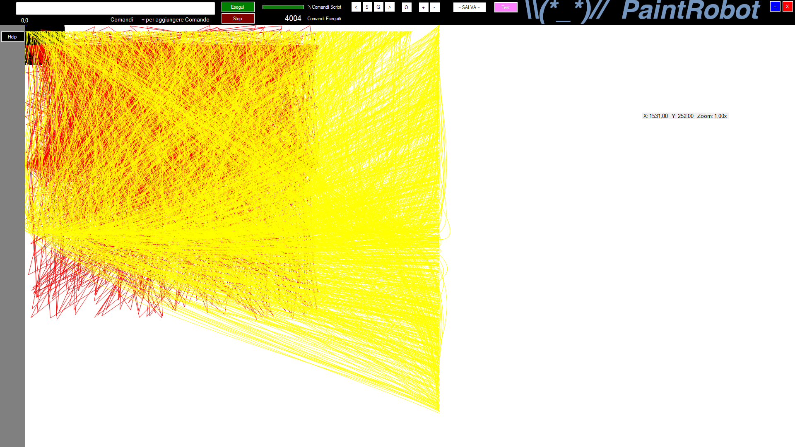
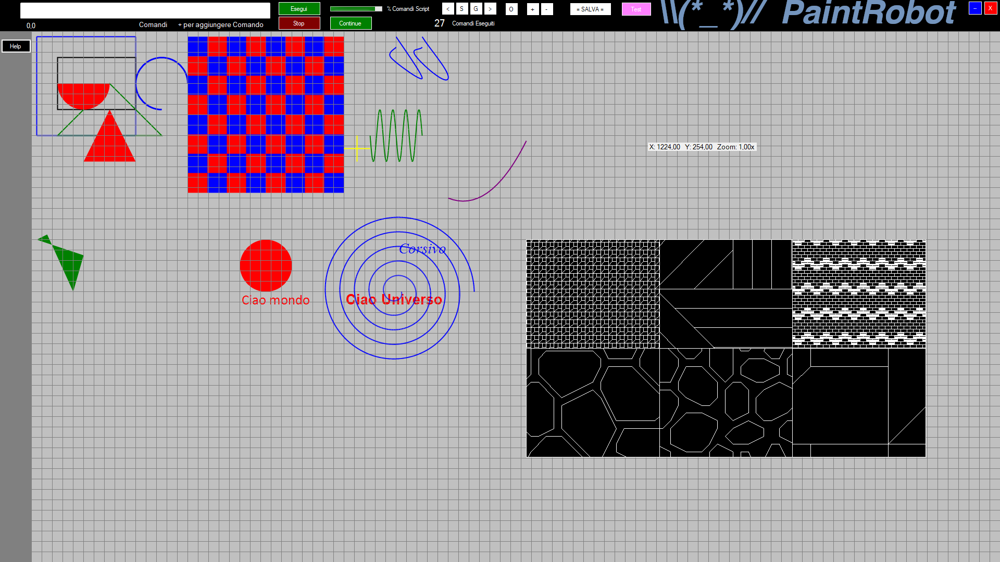

# PaintRobot 🖌️🤖

**PaintRobot** è una applicazione **WinForms VB.NET (.NET Framework 4.8.1)** che esegue comandi grafici tramite script, ispirandosi allo stile di AutoCAD ma con un approccio completamente automatico.

Non è un CAD interattivo: PaintRobot disegna **solo** ciò che viene descritto in uno script, garantendo risultati sempre identici e riproducibili.

---

## 📌 Caratteristiche principali

- Rendering grafico **timer-driven**
- Esecuzione rapida di **migliaia di comandi grafici**
- Linguaggio proprietario **PaintRobotScript**
- Nessuna interferenza dell’utente durante il disegno
- Output coerente su qualsiasi sistema Windows
- Ideale per disegno automatico, generativo o standardizzato

---

## ❓ Cos’è PaintRobot

PaintRobot **non è AutoCAD**.  
È un motore grafico che interpreta uno script e disegna automaticamente forme, pattern, testi e immagini.

Attualmente **non è possibile modificare il disegno con mouse o tastiera**: tutto passa dallo script.

---

## ⚙️ Come funziona

PaintRobot utilizza una tecnologia chiamata **Timer-Driven Rendering**:

- I comandi vengono eseguiti a blocchi
- Un singolo ciclo di rendering
- L’esecuzione può solo essere avviata o fermata
- Massima velocità e coerenza del risultato

---

## 👤 A chi è utile

PaintRobot è utile se ti serve:

- Un **CAD automatico**
- Disegni sempre identici e standardizzati
- Nessuna variabilità dovuta all’operatore
- Generazione grafica tramite script

---

## 🛠️ Modifica del codice

Il progetto è **open source**.  
Puoi modificare liberamente il codice sorgente secondo i termini della licenza.

---

## 📜 Licenza

**MIT License / Public**  
Usalo, modificalo e ridistribuiscilo liberamente.

---

## 🧾 Linguaggio PaintRobotScript

## ⬇️ Download

Puoi scaricare il codice sorgente direttamente da GitHub:

- **Code → Download ZIP**
- oppure clona il repository:
- git clone https://github.com/Nhor2/PaintRobot.git

## 🏷️ Versioni

- **v2.0** – Prima release pubblica (codice sorgente)
 
>>>>>>> 8c2d1e810aa72bf446efdd9937d874e6edf7013c
